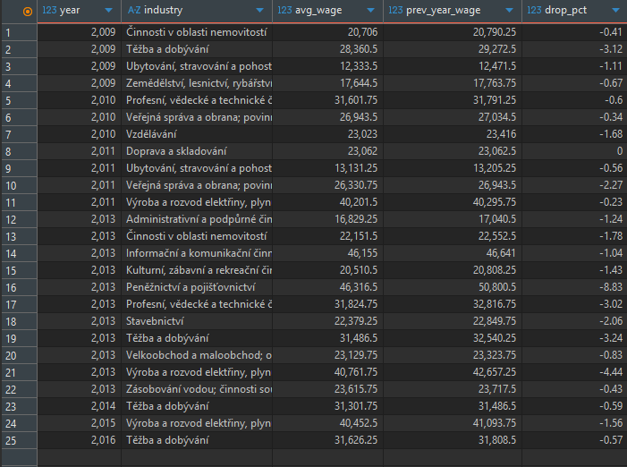
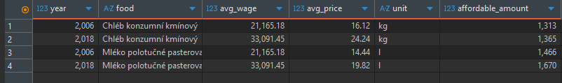
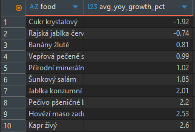
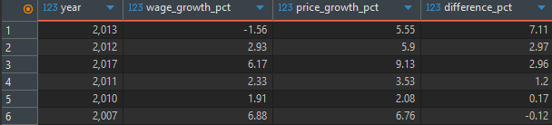
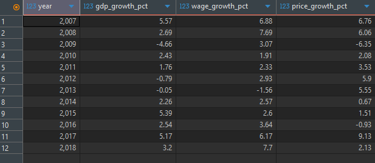

# Vývoj mezd a cen potravin v ČR

## Shrnutí projektu
Cílem tohoto projektu bylo analyzovat vývoj průměrných mezd a cen základních potravin v České republice a posoudit jejich vliv na dostupnost potravin (kupní sílu) pro obyvatelstvo. Analýza vychází z veřejně dostupných datových sad a zaměřuje se na porovnání růstových trendů mezd, zdražování potravin a prozkoumání jejich korelace s makroekonomickým ukazatelem HDP.

Výstupem projektu jsou vlastní datové sady (primární a sekundární tabulka) a zodpovězení pěti výzkumných otázek týkajících se ekonomického vývoje v ČR.

## Výzkumné otázky
1. Rostou v průběhu let mzdy ve všech odvětvích, nebo v některých klesají?
2. Kolik je možné si koupit litrů mléka a kilogramů chleba za první a poslední srovnatelné období v dostupných datech cen a mezd?
3. Která kategorie potravin zdražuje nejpomaleji (je u ní nejnižší percentuální meziroční nárůst)?
4. Existuje rok, ve kterém byl meziroční nárůst cen potravin výrazně vyšší než růst mezd (větší než 10 %)?
5. Má výška HDP vliv na změny ve mzdách a cenách potravin? Neboli, pokud HDP vzroste výrazněji v jednom roce, projeví se to na cenách potravin či mzdách ve stejném nebo následujícím roce výraznějším růstem?

## Struktura repozitáře
Projekt je rozdělen do logických složek pro oddělení kódu a vizuálních výstupů:

* **Složka `Skripty/`** – Obsahuje veškeré SQL skripty využité k analýze:
  * `pomocne_tabulky.sql` – Kód pro přípravu a vyčištění původních dat o mzdách a cenách.
  * `primary_final.sql` – Tvorba hlavní sjednocené tabulky.
  * `secondary_final.sql` – Tvorba dodatečné makroekonomické tabulky.
  * `ukol_1.sql` až `ukol_5.sql` – Samostatné skripty řešící pět výzkumných otázek.
* **Složka `Výsledky/`** – Obsahuje screenshoty tabulkových výstupů z databáze DBeaver dokazující funkčnost skriptů (`vysledek_1.png` až `vysledek_5.png`).

## Zdroje dat
Datové sady pocházejí z Portálu otevřených dat ČR a dalších poskytnutých databází:
* `czechia_payroll` a související číselníky (mzdy, odvětví, kalkulace)
* `czechia_price` a související číselníky (ceny, kategorie potravin)
* `countries` a `economies` (makroekonomické údaje států)

## Metodika a tvorba tabulek

### A) Zpracování a čištění dat (Pomocné tabulky)
Před samotnou analýzou byla data vyčištěna za vzniku pomocných tabulek, aby se předešlo zkreslení výsledků:
* **Tabulka mezd (`t_erik_hrazdira_wages`):** Záznamy byly striktně vyfiltrovány pouze na kód kalkulace `200` (přepočtený počet zaměstnanců na plný úvazek), čímž se eliminovalo zkreslení průměru zaměstnanci na částečný úvazek. Byla vybrána hodnota `5958` (průměrná hrubá mzda).
* **Tabulka cen (`t_erik_hrazdira_prices`):** Ceny potravin byly normalizovány na přesně 1 standardní jednotku (1 kg, 1 l, 1 ks) vydělením hodnoty velikostí referenčního balení.

### B) Vytvoření hlavní tabulky (Primary Final)
* **`t_erik_hrazdira_project_SQL_primary_final`**: Ke sjednocení průměrných ročních mezd a průměrných cen potravin byl použit `INNER JOIN` na základě společného roku. Tím bylo zaručeno, že finální tabulka obsahuje pouze "srovnatelná období" (roky, pro které existují v datech obě hodnoty).

### C) Vytvoření dodatečné tabulky (Secondary Final)
* **`t_erik_hrazdira_project_SQL_secondary_final`**: Spojení tabulek `countries` a `economies` přes `INNER JOIN`. Data byla omezena na evropský kontinent a odstraněny záznamy s chybějícím HDP.

### Použité analytické nástroje a SQL funkce
Během řešení úkolů byly aplikovány následující SQL techniky:
* **CTE (Common Table Expressions / klauzule `WITH`)** pro přehledné strukturování složitých dotazů do logických kroků.
* **Okenní funkce `LAG()`** pro zjištění hodnot z předchozího roku a výpočet meziročních procentuálních změn.
* **Agregační funkce** (`AVG`, `MIN`, `MAX`) spojené s `GROUP BY` pro získání celorepublikových průměrů z dílčích záznamů.
* **Aritmetické operátory a `ROUND()`** pro výpočty rozdílů, procent a zaokrouhlování na 2 desetinná místa.
* **Klíčové slovo `DISTINCT`** pro zabránění zdvojování záznamů při výpočtech nad celkovou "Primary" tabulkou (kvůli kartézskému součinu kategorií a odvětví).

---

## Řešení výzkumných otázek

### ÚKOL 1: Rostou v průběhu let mzdy ve všech odvětvích, nebo v některých klesají?
**Odpověď:** Mzdy ve všech odvětvích nepřetržitě nerostou, z dat je patrná řada meziročních poklesů. Například v krizovém roce 2009 klesly průměrné mzdy v odvětví Těžba a dobývání (o 3,12 %) nebo Ubytování, stravování a pohostinství (o 1,11 %). Nejvýraznější plošný propad příjmů byl zaznamenán v roce 2013, kdy průměrná hrubá mzda klesla hned v 11 sledovaných odvětvích. Nejhlubší propad v tomto roce zaznamenalo Peněžnictví a pojišťovnictví (-8,83 %) a Výroba a rozvod elektřiny (-4,44 %).

### ÚKOL 2: Kolik je možné si koupit litrů mléka a kilogramů chleba za první a poslední srovnatelné období?
**Odpověď:** Prvním srovnatelným obdobím je rok 2006 a posledním rok 2018. Během tohoto období se kupní síla celkově zvýšila. 
* V roce 2006 činila celorepubliková průměrná hrubá mzda napříč odvětvími 21 165,18 Kč. Za tuto částku bylo možné zakoupit **1 313 kg chleba** (průměrná cena 16,12 Kč/kg) nebo **1 466 litrů mléka** (průměrná cena 14,44 Kč/l). 
* V roce 2018 průměrná mzda stoupla na 33 091,45 Kč. Obyvatelé si z ní mohli dovolit zakoupit **1 365 kg chleba** (cena 24,24 Kč/kg) a **1 670 litrů mléka** (cena 19,82 Kč/l).

### ÚKOL 3: Která kategorie potravin zdražuje nejpomaleji?
**Odpověď:** Nejpomaleji zdražující kategorií (zde dokonce zlevňující) je **Cukr krystalový**, u kterého byl zaznamenán průměrný meziroční pokles ceny o -1,92 %. Druhou potravinou, která v čase průměrně zlevňovala, byla Rajská jablka červená (meziroční pokles o -0,74 %). Pokud budeme brát v úvahu výhradně potraviny, které průměrně zdražovaly, nejpomalejší růst vykazovaly Banány žluté (0,81 %), Vepřová pečeně (0,99 %) a Přírodní minerální voda (1,02 %).

### ÚKOL 4: Existuje rok, ve kterém byl meziroční nárůst cen potravin výrazně vyšší než růst mezd (větší než 10 %)?
**Odpověď:** Z dat vyplývá, že v žádném ze sledovaných roků nepřekonal nárůst cen potravin růst mezd o více než 10 %. K největší disproporci došlo v roce 2013, kdy průměrné ceny sledovaných potravin meziročně vzrostly o 5,55 %, avšak průměrné mzdy obyvatel poklesly o 1,56 %. Rozdíl v tomto roce činil celkem 7,11 %. V ostatních letech se rozdíl pohyboval pod hranicí 3 %.

### ÚKOL 5: Má výška HDP vliv na změny ve mzdách a cenách potravin?
**Odpověď:** Vývoj HDP má prokazatelný vliv, nicméně reakce trhu vykazuje rozdílnou dynamiku a setrvačnost pro ceny a pro mzdy.
* Při náhlém propadu HDP (např. hospodářská krize v roce 2009 s poklesem HDP o -4,66 %) reagují **ceny potravin téměř okamžitě** a velmi citlivě (v tomto roce okamžité zlevnění o -6,35 %).
* **Vývoj mezd má naproti tomu značnou setrvačnost** a reaguje se zpožděním 1 až 2 let. Například při dalším drobném poklesu HDP v roce 2012 (-0,79 %) se mzdy propadly do záporných čísel (-1,56 %) až v následujícím roce 2013. 
* V obdobích ekonomického růstu (roky 2015 a 2017 s růstem HDP přes 5 %) následovalo v bezprostředně navazujících letech plynulé a stabilní zrychlování růstu průměrných mezd.

## Závěr
Analýza prokázala, že navzdory celkovému růstu životní úrovně a zvyšující se kupní síle mezi lety 2006 a 2018 není ekonomický vývoj lineární. Krizové roky silně ovlivňují zejména mzdy (s určitým časovým zpožděním) a způsobují jejich reálný pokles. K největšímu narušení kupní síly v analyzovaném období došlo kolem roku 2013. Zároveň se potvrdil předpoklad, že agregované ceny potravin reagují na otřesy v ekonomice (HDP) mnohem pružněji než mzdový systém.
